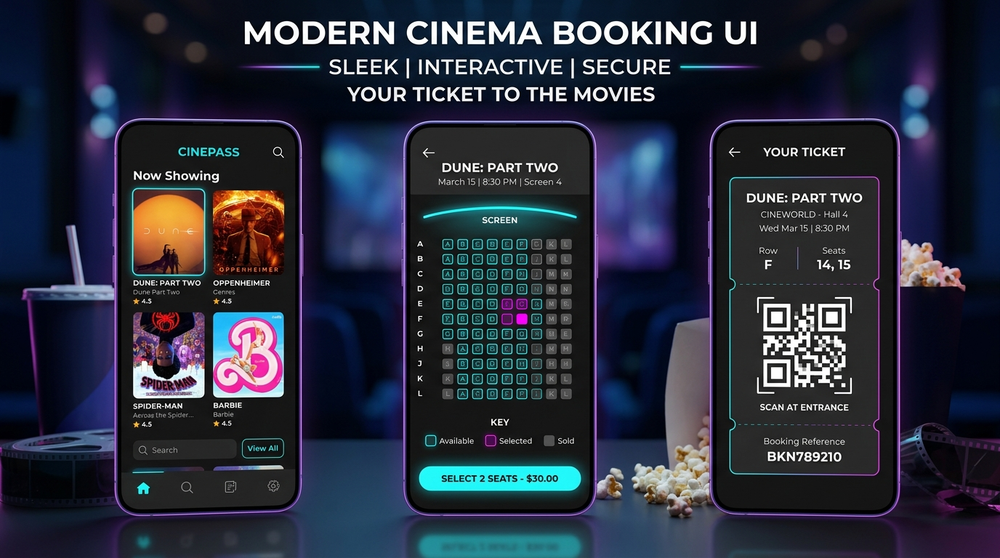
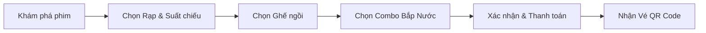

<div align="center">

# 🎬 Movie Ticket Booking App

**Ứng dụng đặt vé xem phim trực tuyến hiện đại trên nền tảng Flutter**

Tra cứu lịch chiếu · Chọn ghế tương tác · Combo bắp nước · Thanh toán đa kênh · Vé điện tử QR Code

[](https://flutter.dev/)
[](https://dotnet.microsoft.com/)
[](https://www.docker.com/)
[](https://www.microsoft.com/sql-server)
[](https://riverpod.dev/)
[](https://pub.dev/packages/go_router)
[](https://pub.dev/packages/dio)
[](#-cấu-trúc-hệ-thống--kiến-trúc-dự-án)

<br/>



</div>

---

## 📋 Tổng quan dự án

**Movie Ticket Booking** là ứng dụng di động được xây dựng nhằm mang đến trải nghiệm đặt vé xem phim nhanh chóng, trực quan và tiện lợi cho người dùng. Ứng dụng giải quyết toàn bộ hành trình trải nghiệm của khách hàng: từ lúc tìm kiếm bộ phim yêu thích, xem trailer, chọn cụm rạp, chọn suất chiếu, chọn vị trí ghế ngồi theo thời gian thực cho đến bước thanh toán và lưu trữ vé điện tử có mã **QR Code check-in** tại rạp.

Dự án được thiết kế theo tư duy **Clean Architecture kết hợp Feature-First**, đảm bảo tính mở rộng cao (scalability), dễ bảo trì (maintainability) và dễ kiểm thử (testability).

---

## ✨ Các tính năng nổi bật

### 🍿 1. Khám phá & Trải nghiệm điện ảnh
* **Trang chủ trực quan:** Phân chia rõ ràng mục **Đang chiếu (Now Playing)** và **Sắp chiếu (Coming Soon)**, banner carousel nổi bật.
* **Chi tiết phim chi tiết:** Đầy đủ thông tin đạo diễn, diễn viên, thời lượng, thể loại, điểm đánh giá và **xem Trailer trực tiếp** qua YouTube Player.
* **Tìm kiếm thông minh:** Tìm nhanh phim theo tên, thể loại hoặc theo cụm rạp.
* **Danh sách yêu thích (Watchlist):** Lưu lại các bộ phim muốn xem để theo dõi lịch chiếu.

### 🏛️ 2. Hệ thống Rạp & Suất chiếu linh hoạt
* **Cụm rạp đối tác:** Tra cứu danh sách hệ thống rạp, địa chỉ và thông tin vị trí.
* **Lịch chiếu đa chiều:** Xem suất chiếu theo từng rạp hoặc xem tất cả các rạp đang chiếu bộ phim đã chọn theo từng khung giờ.

### 💺 3. Sơ đồ Ghế ngồi tương tác (Interactive Seat Map)
* **Mô phỏng phòng chiếu chân thực:** Thiết kế màn hình cong sinh động.
* **Phân cấp loại ghế rõ ràng:** Ghế Thường (Standard), Ghế VIP, Ghế Đôi (Sweetbox) với biểu tượng và mức giá tương ứng.
* **Trạng thái ghế thời gian thực:** Nhận biết ghế trống (Available), ghế đang chọn (Selected) và ghế đã có người đặt (Reserved/Sold).

### 🥤 4. Combo Bắp nước & Ưu đãi (F&B Combos)
* Tùy chọn mua kèm các gói bắp rang, nước ngọt, snack với giá ưu đãi.
* Quản lý số lượng và tự động cộng dồn vào tổng tiền đơn hàng.

### 💳 5. Thanh toán & Xác nhận đơn hàng
* Tóm tắt chi tiết hóa đơn (Phim, Rạp, Suất chiếu, Số ghế, Combo, Tổng tiền).
* Hỗ trợ đa dạng phương thức thanh toán: **PayOS (QR chuyển khoản)**, thẻ ngân hàng Visa/MasterCard, Apple Pay, Google Pay, PayPal.

### 🎟️ 6. Vé điện tử & QR Code Check-in
* Tự động sinh mã **QR Code** bảo mật cho từng vé sau khi thanh toán thành công.
* Quản lý mục **Vé của tôi (My Tickets)**: Tra cứu vé sắp xem và lịch sử vé đã sử dụng.

### 📰 7. Cộng đồng & Cá nhân hóa
* **Blog & Đánh giá:** Bài viết tin tức điện ảnh, đánh giá từ cộng đồng khán giả.
* **Tài khoản:** Đăng nhập tiện lợi (Email & Google Sign-In), cập nhật thông tin cá nhân và quản lý thông báo.

---

## 🔄 Quy trình đặt vé (Booking Flow)



---

## 🏛️ Cấu trúc hệ thống & Kiến trúc dự án

Dự án được tổ chức dạng **Monorepo** tích hợp trọn vẹn cả **Backend API (.NET 9)** và **Client (Flutter)**:

```
movie-ticket-booking/
├── backend/                    # Backend REST API (.NET 9, EF Core, SQL Server)
│   ├── Controllers/            # API Endpoints (Movies, Cinemas, Showtimes, Booking, PayOS...)
│   ├── Data/                   # AppDbContext, Entity Configurations & Seed Data
│   ├── Domain/                 # Domain Entities (Movie, Cinema, Seat, Ticket, User...)
│   ├── Migrations/             # EF Core Database Migrations
│   ├── Repositories/           # Data Access Layer (Repository Pattern)
│   ├── Services/               # Business Logic Layer (PayOS, Email OTP, Background Jobs...)
│   └── Dockerfile              # Dockerfile tối ưu cho .NET 9 API
├── lib/                        # Flutter Client (Clean Architecture + Feature-First)
│   ├── app/                    # Cấu hình toàn cục, App Router (GoRouter), Theme
│   ├── core/                   # Shared Modules (DioClient, Constants, Base Widgets)
│   ├── domain/                 # Entities, Repository Interfaces, UseCases
│   └── features/               # 15+ Feature Modules độc lập (Riverpod State)
├── docker-compose.yml          # Điều phối SQL Server + Backend .NET + Frontend Web
├── Dockerfile.frontend         # Multi-stage build: Flutter Web Release -> Nginx
└── nginx.conf                  # Nginx SPA config cho Flutter Web
```

---

## 🚀 Khởi chạy hệ thống

### Cách 1: Khởi chạy nhanh toàn bộ bằng Docker (Khuyên dùng ⭐️)
Chỉ cần máy cài [Docker Desktop](https://www.docker.com/products/docker-desktop/), bạn không cần cài đặt .NET SDK, SQL Server hay Flutter SDK:

```bash
# Khởi chạy trọn gói Database SQL Server, Backend API và Web Frontend
docker compose up -d --build
```

Sau khi khởi chạy hoàn tất:
* 🌐 **Frontend (Flutter Web):** [http://localhost:3000](http://localhost:3000)
* ⚙️ **Backend REST API:** [http://localhost:7132](http://localhost:7132) hoặc [http://localhost:5000](http://localhost:5000)
* 🗄️ **Database (SQL Server 2022):** `localhost:1433` (User: `sa` / Pass: `YourStrong@Password123`)
* *Hệ thống tự động thực thi EF Core Migrations và nạp sẵn dữ liệu mẫu khi khởi động.*

```bash
# Dừng toàn bộ hệ thống
docker compose down
```

---

### Cách 2: Chạy Flutter Client cục bộ (Mobile / Desktop)

```bash
# 1. Cài đặt thư viện phụ thuộc
flutter pub get

# 2. Kiểm tra thiết bị kết nối
flutter devices

# 3. Khởi chạy trên thiết bị đã chọn
flutter run
```


---

## 📱 Trải nghiệm tính năng

* Ứng dụng hỗ trợ cả dữ liệu thử nghiệm (**Mock Data**) nội bộ nằm tại thư mục `assets/mock/` giúp chạy thử nghiệm mượt mà ngay cả khi không có kết nối mạng.
* Khi kết nối API thực tế, ứng dụng kết nối trực tiếp với dịch vụ backend qua cấu hình tại `lib/core/constants/`.

---

## 🤝 Thành viên phát triển

* **Nguyễn Hữu Huân** ([@mrduck58](https://github.com/mrduck58)) — *Lead Developer / Mobile & System*
* Cùng các thành viên đóng góp trong nhóm dự án.

---

<div align="center">
  <sub>Dự án được xây dựng với niềm đam mê công nghệ di động và trải nghiệm người dùng tối ưu.</sub>
</div>